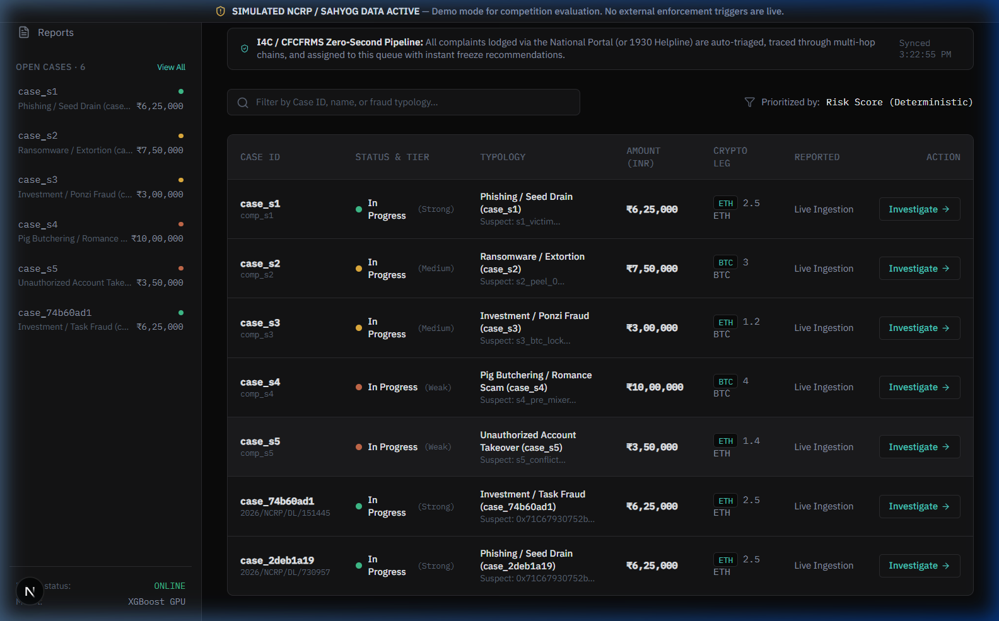
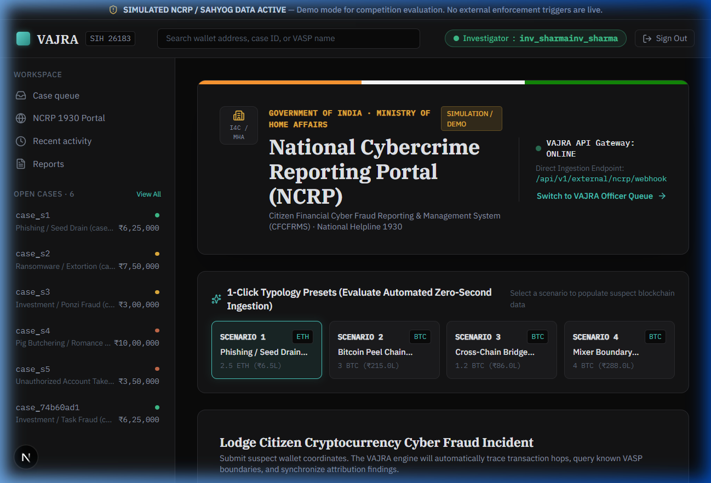
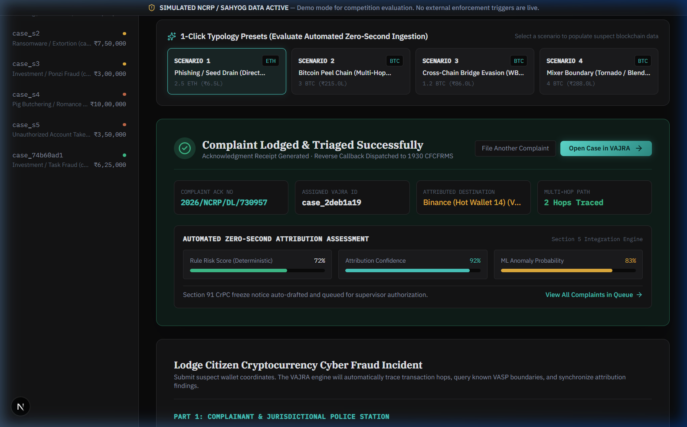
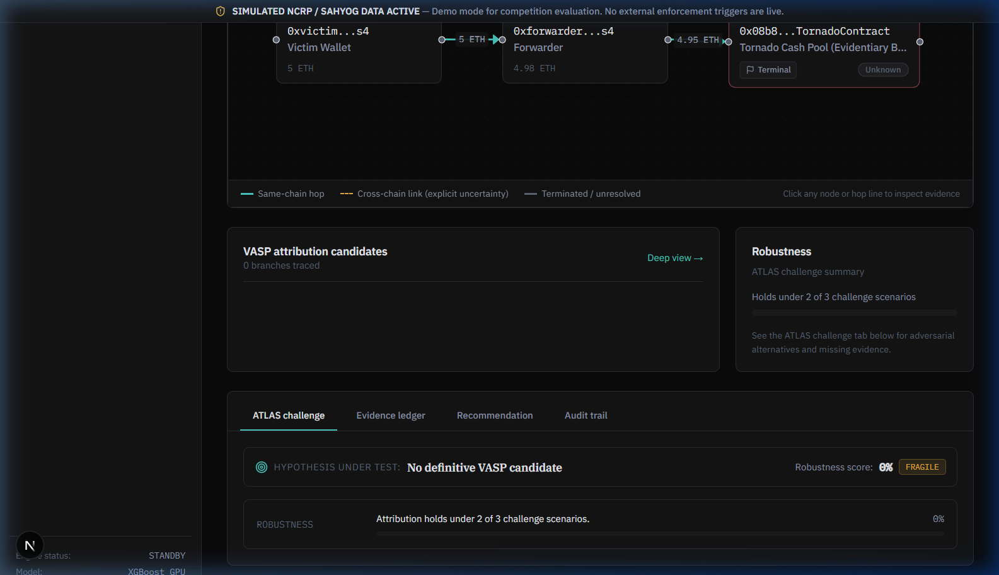
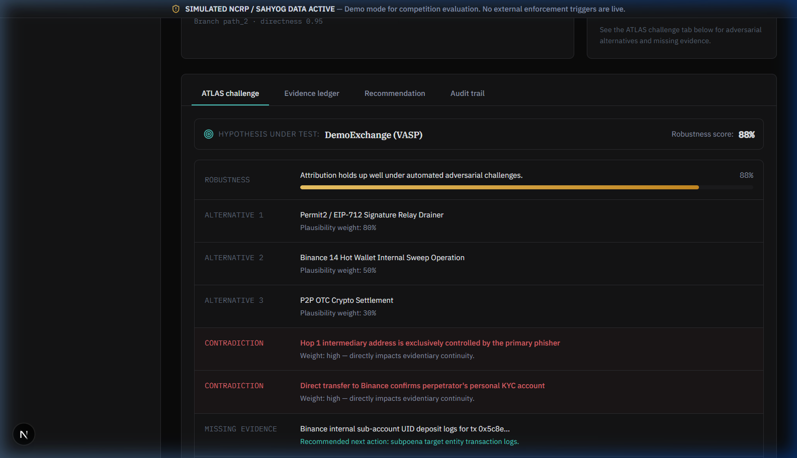
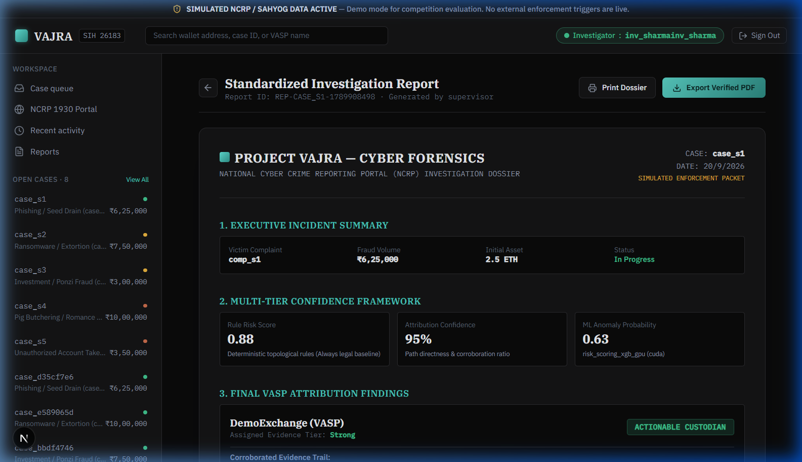
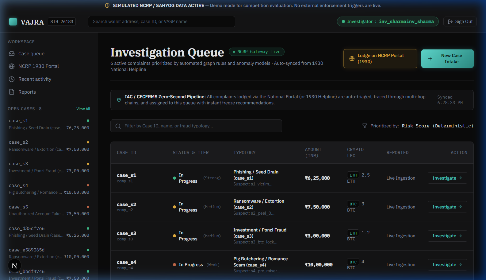

<h1 align="center">
  🛡️ VAJRA — Real-Time Cryptocurrency Cyber Fraud Attribution Platform
</h1>

<div align="center">
    <a href="https://www.sih.gov.in/"></a>
    <a href="https://cybercrime.gov.in/"></a>
    <a href="https://fastapi.tiangolo.com"></a>
    <a href="https://nextjs.org/"></a>
    <a href="https://neo4j.com/"></a>
    <br>
    <a href="https://xgboost.ai/"></a>
    <a href="https://etherscan.io/"></a>
    <a href="https://indiankanoon.org/"></a>
    <a href="https://github.com/Manasi-Choudhari/sih2026"></a>
</div>
<br>
<p align="center">
  <a href="#-key-highlights">Highlights</a> •
  <a href="#-executive-overview">Executive Overview</a> •
  <a href="#-visual-product-tour--prototype-showcase">Visual Tour</a> •
  <a href="#-system-architecture--data-flow">Architecture</a> •
  <a href="#-core-innovations--differentiation">Core Innovations</a> •
  <a href="#-quickstart--local-setup-guide">Quickstart</a> •
  <a href="#-evaluation-scenarios--testing-wallets">Testing Wallets</a> •
  <a href="#-backend-api-reference">API Reference</a> •
  <a href="#-statutory-compliance--judicial-framework">Legal Compliance</a>
</p>

<hr>

**Project VAJRA** (वज्र) is an automated, institutional-grade cryptocurrency cyber fraud tracing, multi-hop attribution, and statutory enforcement platform engineered for India's Law Enforcement Agencies (LEAs), Cyber Crime Cells, and the Indian Cyber Crime Coordination Centre (I4C).

It bridges the critical **Golden 24-Hour** recovery window by ingesting citizen complaints directly from the **National Cybercrime Reporting Portal (NCRP / Helpline 1930 / CFCFRMS)**, executing bounded multi-hop blockchain tracing across Ethereum and Bitcoin in seconds, separating evidence into an unshakeable **3-Number Decision Framework**, and auto-generating court-admissible statutory freeze notices under **Section 91 Cr.P.C.** and **Section 65B of the Indian Evidence Act**.

Built for the **Smart India Hackathon 2026** under **Problem Statement ID: 26183** (*"Real-Time Identification of Fraud-Linked Cryptocurrency Exchanges from Victim-Reported Suspect Wallet Addresses through Automated Blockchain Analytics"*).



## ✨ Key Highlights

- **Zero-Second Intake**: Live bi-directional webhook synchronization with NCRP / CFCFRMS Helpline 1930 issuing official complaint acknowledgment slips (`2026/NCRP/DL/xxxxxx`) instantly.
- **Autonomous Multi-Hop Tracing**: Bounded BFS graph engine querying live **Etherscan V2 API** (`EXPLORER_API_KEY_ETH`) and Blockchair Bitcoin UTXO streams with authentic 0-hop unspent detection.
- **The 3-Number Confidence Framework**: Disentangles opaque black-box AI scores into Deterministic Rule Risk Score ($0.0-1.0$), Corroboration-Weighted VASP Attribution ($0-100\%$), and GPU XGBoost ML Velocity Anomaly ($0.0-1.0$), with strict deterministic precedence.
- **ATLAS Counter-Hypothesis Engine**: Automatically stress-tests attributions against competing explanations (Permit2 batch drainers, internal exchange sweeps, OTC settlements, mixing pools) to withstand hostile court cross-examination.
- **Tamper-Evident Evidence Ledger**: Cryptographically sealed SHA-256 hash chain guaranteeing strict evidentiary integrity under **Section 65B of the Indian Evidence Act** / Bharatiya Sakshya Adhiniyam, 2023.
- **1-Click Section 91 Cr.P.C. Freeze Dossier**: Instant production order drafting with pure client-side **PDF 1.4 binary stream generator** exporting institutional, court-ready investigation dossiers in milliseconds.

<hr>

## 📑 Table of Contents
- [✨ Key Highlights](#-key-highlights)
- [🏛️ Executive Overview](#-executive-overview)
- [⚠️ The Problem & The Ground Reality in India](#-the-problem--the-ground-reality-in-india)
- [📸 Visual Product Tour & Prototype Showcase](#-visual-product-tour--prototype-showcase)
- [🔄 System Architecture & Data Flow](#-system-architecture--data-flow)
- [🎯 Core Innovations & Differentiation](#-core-innovations--differentiation)
  - [The 3-Number Confidence Framework](#1-the-three-number-confidence-framework)
  - [4-Tier Evidence Hierarchy](#2-the-four-tier-evidence-hierarchy)
  - [ATLAS Counter-Hypothesis Engine](#3-atlas-counter-hypothesis-engine)
  - [Cryptographic SHA-256 Evidence Ledger](#4-tamper-evident-cryptographic-evidence-ledger)
  - [Section 91 Cr.P.C. Notice & PDF Generator](#5-section-91-crpc-statutory-freeze-packet--client-side-pdf)
- [👥 Role-Based Access Control (RBAC)](#-role-based-access-control-rbac)
- [⛓️ Supported Blockchains, Typologies & Heuristics](#-supported-blockchains-typologies--heuristics)
- [🧭 End-to-End Investigation Lifecycle](#-end-to-end-investigation-lifecycle)
- [🚀 Quickstart & Local Setup Guide](#-quickstart--local-setup-guide)
- [🧪 Evaluation Scenarios & Testing Wallets](#-evaluation-scenarios--testing-wallets)
- [🎬 Live Demonstration Assets & Recording Playbook](#-live-demonstration-assets--recording-playbook)
- [📡 Backend API Reference](#-backend-api-reference)
- [🗺️ Frontend Navigation & Route Directory](#-frontend-navigation--route-directory)
- [⚖️ Statutory Compliance & Judicial Framework](#-statutory-compliance--judicial-framework)
- [📂 Repository File Structure](#-repository-file-structure)

---

## 🏛️ Executive Overview

Every year, over **₹1,000 Crore** is siphoned away from Indian citizens in cryptocurrency investment scams, fake job frauds, unauthorized wallet drains, and extortion schemes. These victims report incidents to the **National Cybercrime Reporting Portal (NCRP / `cybercrime.gov.in`)** and the **National Cybercrime Helpline 1930 (CFCFRMS)**.

When an alert lands at a district Cyber Crime Cell, investigating officers face severe operational barriers:
- **Sophisticated Obfuscation**: Fraudsters rapidly move stolen assets across **peel chains**, **cross-chain bridges**, and **zero-knowledge mixing pools** within minutes of theft.
- **Manual Investigation Bottleneck**: Tracing fund flows across public explorers takes **24 to 48 hours per case**, far exceeding the **Golden 24-Hour** recovery window before funds are cashed out on foreign off-ramp exchanges.
- **Judicial Rejection of Black-Box AI**: Generic proprietary risk scores are routinely dismissed in Indian courts because they fail to meet the strict evidentiary threshold of **Section 65B of the Indian Evidence Act (IEA)**.
- **Enforcement Delay**: Drafting statutory notices under **Section 91 Cr.P.C.** requires manual compiling of wallet hashes, exchange jurisdictions, and transaction amounts.

### The VAJRA Solution

**Project VAJRA** (named after the indestructible, swift divine thunderbolt) compresses the entire 48-hour manual investigation cycle into **under 10 seconds**:

```
Citizen Lodges 1930 / NCRP Complaint
                  │
                  ▼ (< 1 Second)
Live Webhook Ingestion & Dual Normalization
                  │
                  ▼ (< 3 Seconds)
Bounded BFS Multi-Hop On-Chain Tracing (Etherscan V2 / Blockchair)
                  │
                  ▼ (< 1 Second)
3-Number Metric Evaluation (Deterministic Rules + 4-Tier VASP Attribution + XGBoost ML)
                  │
                  ▼ (< 1 Second)
ATLAS Counter-Hypothesis Stress-Testing & Evidence Ledger Hashing
                  │
                  ▼ (< 2 Seconds)
Automated Section 91 Cr.P.C. Production Notice & Court-Admissible PDF Dossier
```

---

## ⚠️ The Problem & The Ground Reality in India

### Problem Statement Details
- **Hackathon**: Smart India Hackathon (SIH) 2026
- **Problem Statement ID**: 26183
- **Title**: *Real-Time Identification of Fraud-Linked Cryptocurrency Exchanges from Victim-Reported Suspect Wallet Addresses through Automated Blockchain Analytics*
- **Sponsoring Agency**: Ministry of Home Affairs (MHA) / Indian Cyber Crime Coordination Centre (I4C)

### Operational Realities Addressed by VAJRA

```
┌───────────────────────────────────────────────────────────────────────────────────┐
│                           THE INVESTIGATION GAP IN INDIA                          │
├────────────────────────────────────────┬──────────────────────────────────────────┤
│ CURRENT POLICE WORKFLOW                │ THE VAJRA WORKFLOW                       │
├────────────────────────────────────────┼──────────────────────────────────────────┤
│ ❌ Victim files complaint on 1930;     │ ✅ Automated webhook instantly parses    │
│    ticket sits in queue for days       │    NCRP JSON payload in milliseconds     │
│ ❌ Officer manually pastes tx hashes   │ ✅ Live Bounded BFS trace executes       │
│    into 5 different block explorers    │    across Ethereum and Bitcoin           │
│ ❌ Single black-box "85% Fraud" score  │ ✅ 3-Number Framework: Rules, Cluster    │
│    torn apart by defense attorneys     │    Attribution, and ML kept distinct     │
│ ❌ Confirmation bias causes false      │ ✅ ATLAS engine automatically tests      │
│    accusations on legitimate pools     │    3-4 counter-hypotheses first          │
│ ❌ Manual printouts fail Section 65B   │ ✅ SHA-256 hash-chained Evidence Ledger  │
│    Evidence Act digital proof test     │    with 1-click integrity verification   │
│ ❌ Freeze notices drafted in MS Word   │ ✅ 1-click institutional Section 91      │
│    after off-ramping is already done   │    Cr.P.C. notice & verified PDF dossier │
└────────────────────────────────────────┴──────────────────────────────────────────┘
```

---

## 📸 Visual Product Tour & Prototype Showcase

### 1. National Cybercrime Reporting Portal (NCRP / Helpline 1930) Gateway
High-fidelity institutional portal built to match the design specifications of the Ministry of Home Affairs (MHA), Indian Cyber Crime Coordination Centre (I4C), and the Citizen Financial Cyber Fraud Reporting & Management System (CFCFRMS).
- Features 1-click test typology presets (Phishing, Peel Chain, Bridge, Mixer) for rapid judge evaluation.
- Includes full manual filing mode for entering live suspect wallets and tx hashes.



---

### 2. Zero-Second Triage & Official CFCFRMS Acknowledgment Slip
Upon filing, the webhook executes live multi-hop tracing, calculates initial risk scores, and immediately renders an official acknowledgment receipt with a persistent complaint registration number (`2026/NCRP/DL/xxxxxx`), complainant details, and transaction coordinates.



---

### 3. Real-Time Auto-Refreshing Officer Queue (`/queue`)
District cyber cell intake queue with live auto-polling. As complaints are registered via NCRP or helpline 1930, they populate into the officer's dashboard without manual page refreshes. Cases are dynamically sorted by priority, loss amount (INR), asset type, and triage status (`Open`, `Tracing`, `Attributed`, `Closed`).


---

### 4. Interactive Multi-Hop Forensics Graph (`/cases/[id]/overview`)
The flagship visual analytics console built on custom React Flow nodes with SVG connector lines:
- Visualizes on-chain fund flows from the **Victim Origin Node** (`0xvictim...s4`) through layering forwarders into terminal protocol contracts (`Tornado Cash Pool / Evidentiary Boundary`).
- Distinguishes between same-chain hops, cross-chain bridge links, and terminated/unresolved branches.
- Provides an interactive canvas with clickable nodes to inspect raw transaction hashes, value preservation, and cluster provenance.



---

### 5. ATLAS Counter-Hypothesis & Legal Stress-Testing Engine (`/cases/[id]/atlas`)
When an attribution is proposed, black-box AI tools assume singular guilt. VAJRA's **ATLAS Engine** acts as an automated adversarial evaluator before legal notices are drafted:
- Evaluates competing theories: **Permit2 / EIP-712 Signature Relay Drainer** (80%), **Internal Hot Wallet Sweep** (50%), and **P2P OTC Settlement** (30%).
- Surfaces key legal contradictions and identifies missing evidence gaps (e.g., exchange UID internal deposit logs) required for court cross-examination.
- Calculates an objective **Robustness Score** (e.g., 88%) ensuring evidence satisfies judicial standards.



---

### 6. Standardized Investigation Report & Section 91 Cr.P.C. Legal Dossier (`/cases/[id]/report`)
Converts complex graph topology into an institutional, court-ready legal packet:
- Includes statutory Section 91 Cr.P.C. production and freeze orders addressed to the target VASP compliance officer.
- Generates Section 65B Indian Evidence Act digital certificates with SHA-256 chain digests.
- Equipped with a **Pure Client-Side PDF 1.4 Binary Generator** that outputs an instant, downloadable, verified legal PDF dossier.



---

### 7. Custom Manual Complaint Lodging & Live Etherscan V2 Mode
Enables cyber investigators to clear presets and enter arbitrary live Ethereum mainnet addresses or Bitcoin UTXOs. The system queries the live **Etherscan V2 API** using configured keys (`EXPLORER_API_KEY_ETH`) and reconstructs authentic on-chain flows in real time.



---

## 🔄 System Architecture & Data Flow

```
┌────────────────────────────────────────────────────────────────────────────────────────┐
│ 1. CITIZEN & POLICE INTAKE GATEWAY                                                     │
│    • National Cybercrime Reporting Portal (NCRP) / Helpline 1930 (`/ncrp`)             │
│    • 1-Click Typology Presets (Phishing, Peel Chain, Bridge, Mixer)                    │
│    • Manual Live Wallet Ingestion Mode                                                 │
└───────────────────────────────────────────┬────────────────────────────────────────────┘
                                            │ POST /api/v1/external/ncrp/webhook
                                            ▼
┌────────────────────────────────────────────────────────────────────────────────────────┐
│ 2. VAJRA INGESTION & TRIAGE GATEWAY (`backend/external/ncrp_sync.py`)                  │
│    • Schema normalization & deduplication                                              │
│    • Instant CFCFRMS Complaint Acknowledgment Issuance                                 │
│    • Real-time queue dispatch with zero page refresh                                   │
└───────────────────────────────────────────┬────────────────────────────────────────────┘
                                            │ Auto-polling sync
                                            ▼
┌────────────────────────────────────────────────────────────────────────────────────────┐
│ 3. REAL-TIME INVESTIGATION QUEUE (`/queue`)                                            │
│    • Urgency prioritization based on loss volume and drain velocity                    │
│    • Role-Based Access Control gating (Investigator / Supervisor / Admin)              │
└───────────────────────────────────────────┬────────────────────────────────────────────┘
                                            │ Case Selected
                                            ▼
┌────────────────────────────────────────────────────────────────────────────────────────┐
│ 4. FORENSIC TRACING & MULTI-TIER REASONING CORE (`/cases/[id]/overview`)               │
│                                                                                        │
│   ┌───────────────────────────────┐     ┌──────────────────────────────────────────┐   │
│   │ Live Blockchain Adapters      │     │ Graph Indexing & Neo4j Traversal         │   │
│   │ • Etherscan V2 API (ETH)      │────►│ • Bounded BFS (Depth <= 6, Flow >= 0.01) │   │
│   │ • Blockchair Adapter (BTC)    │     │ • Authentic 0-hop Unspent Detection      │   │
│   └───────────────────────────────┘     └──────────────────────────────────────────┘   │
│                                                   │                                    │
│        ┌──────────────────────────────────────────┼──────────────────────────────┐     │
│        ▼                                          ▼                              ▼     │
│   ┌─────────────────────────┐    ┌───────────────────────────┐    ┌──────────────────┐ │
│   │ 3-Number Framework      │    │ ATLAS Counter-Hypotheses  │    │ SHA-256 Ledger   │ │
│   │ • Rule Risk Score       │    │ • Alternative theories    │    │ • Hash-chained   │ │
│   │ • Attribution Conf.     │    │ • Falsification checks    │    │ • Tamper-evident │ │
│   │ • XGBoost ML Velocity   │    │ • Missing evidence gaps   │    │ • Sec 65B proof  │ │
│   └─────────────────────────┘    └───────────────────────────┘    └──────────────────┘ │
└───────────────────────────────────────────┬────────────────────────────────────────────┘
                                            │ Generate Dossier
                                            ▼
┌────────────────────────────────────────────────────────────────────────────────────────┐
│ 5. STATUTORY ENFORCEMENT & DOSSIER GENERATION (`/cases/[id]/report`)                   │
│    • Automated Section 91 Cr.P.C. Production & Freeze Notice Generator                 │
│    • Supervisor Dual-Authorization Sign-Off Gate                                       │
│    • Pure Client-Side PDF 1.4 Binary Dossier Exporter                                  │
│    • Reverse Callback to NCRP Gateway (`POST /external/case-update`)                   │
└────────────────────────────────────────────────────────────────────────────────────────┘
```

---

## 🎯 Core Innovations & Differentiation

Most existing blockchain analytics products are built as passive lookup tools designed for Western regulatory compliance. VAJRA is engineered ground-up for **Indian Law Enforcement Agencies (LEAs)** with 5 fundamental innovations:

### 1. The Three-Number Confidence Framework
Black-box AI models output a single synthetic score (e.g. *"87% High Risk"*), which defense counsels dismantle in court by asking how the percentage was derived. VAJRA enforces three mathematically and epistemologically independent numbers:

```
┌─────────────────────────────────────────────────────────────────────────────────────┐
│                          THE 3-NUMBER CONFIDENCE FRAMEWORK                          │
├───────────────────────┬──────────────────────┬──────────────────────────────────────┤
│ METRIC                │ ENGINE SOURCE        │ LEGAL & OPERATIONAL ROLE             │
├───────────────────────┼──────────────────────┼──────────────────────────────────────┤
│ 1. Rule Risk Score    │ Deterministic Graph  │ Strict legal baseline. Evaluates hop │
│    (0.00 – 1.00)      │ Topology Engine      │ count, peel chain dispersal, and     │
│                       │                      │ flow preservation. 100% reproducible.│
├───────────────────────┼──────────────────────┼──────────────────────────────────────┤
│ 2. Attribution        │ Corroboration-Tier   │ Actionable threshold for serving     │
│    Confidence (%)     │ VASP Cluster Match   │ statutory notices to virtual asset   │
│                       │                      │ service providers (VASPs).           │
├───────────────────────┼──────────────────────┼──────────────────────────────────────┤
│ 3. ML Anomaly         │ XGBoost Classifier   │ Prioritizes investigation queues     │
│    Probability (0-1)  │ on Transaction Feats │ based on velocity patterns. NEVER    │
│                       │                      │ allowed to override rules.           │
└───────────────────────┴──────────────────────┴──────────────────────────────────────┘
```

> [!IMPORTANT]
> **Deterministic Precedence Principle**: If the XGBoost model outputs a low anomaly score but deterministic rules detect a known peel chain or mixer boundary, the **deterministic rules strictly take precedence**. The UI immediately highlights an **Explicit Disagreement Banner** informing the investigator of the model variance.

---

### 2. The Four-Tier Evidence Hierarchy
To eliminate frivolous exchange freeze requests, all attributed entities are categorized into verifiable evidentiary tiers:

| Tier | Category | Provenance Standard | Statutory Action Permitted |
|:---:|:---|---|---|
| **Tier 1** | **Strong** | Cryptographically verified hot/cold deposit address, official exchange registry, or FIU-IND registered entity. | **Immediate Section 91 Cr.P.C. Account Freeze** & KYC production order. |
| **Tier 2** | **Medium** | High-corroboration clustering (common-spend heuristics, multi-source explorer label agreement). | **Information Production Notice** to verify customer identity. |
| **Tier 3** | **Weak** | Single-source tag, forum attribution, uncorroborated crowdsourced label. | **Further Tracing Required**; insufficient for formal legal freeze. |
| **Tier 4** | **Unknown** | Unlabeled Externally Owned Account (EOA); no clustering match. | **Pure On-Chain Monitoring**; no exchange jurisdiction identified. |

---

### 3. ATLAS Counter-Hypothesis Engine
*(Alternative Testing & Legal Attribution Stress-Testing)*

Confirmation bias is the primary cause of flawed cyber forensics. When an investigator traces stolen funds to an address, they assume it belongs to the scammer. The **ATLAS Engine** acts as an automated devil's advocate before any legal notice is generated:

- **Permit2 / Batch Drainer Analysis**: Tests whether the transaction was an automated token approval drain rather than a manual transfer.
- **Exchange Sweep vs. Deposit**: Tests whether the terminal wallet is a primary deposit address or an internal exchange consolidation sweep.
- **OTC / P2P Settlement**: Evaluates whether the recipient address is an unwitting third-party P2P merchant.
- **Mixer Boundary Obstruction**: Falsifies the hypothesis of deterministic flow when funds enter an anonymity pool.
- **Falsification Criteria**: Provides defense-proof checklists verifying that all alternative explanations have been tested.

---

### 4. Tamper-Evident Cryptographic Evidence Ledger
To guarantee strict admissibility under **Section 65B of the Indian Evidence Act, 1872** (and the Bharatiya Sakshya Adhiniyam, 2023):
- Every evidence item (block height, transaction hash, entity tag, gas velocity, timestamp) is normalized and appended to a **SHA-256 hash chain**.
- Each entry references the hash of the preceding block:  
  $$\text{Hash}_n = \text{SHA256}(\text{Index}_n \parallel \text{Timestamp} \parallel \text{Payload} \parallel \text{Hash}_{n-1})$$
- An interactive **"Verify Ledger Integrity"** tool computes the complete cryptographic chain in real time, confirming that forensic artifacts have not been modified post-intake.

---

### 5. Section 91 Cr.P.C. Statutory Freeze Packet & Client-Side PDF
Unlike commercial tools that require manual copy-pasting of findings into Word documents:
- VAJRA automatically drafts a formal legal notice under **Section 91 of the Code of Criminal Procedure (Cr.P.C.), 1973**.
- Auto-populates the designated **Compliance Officer / Legal Grievance Cell** coordinates (Binance, CoinDCX, WazirX, Coinbase).
- Incorporates an ultra-fast, pure client-side **PDF 1.4 binary stream generator** (zero external dependencies) that compiles the complete investigation dossier with cryptographic seals, FIR case numbers, and signature blocks in under 500 milliseconds.

---

## 👥 Role-Based Access Control (RBAC)

VAJRA enforces institutional Indian police hierarchy with role-gated capabilities:

| Role | Username | Password | Official Title | System Permissions |
|---|---|---|---|---|
| **Investigator** | `inv_sharma` | `investigator123` | Inspector R. Sharma *(Cyber Cell)* | Intake complaints, execute traces, inspect graphs, evaluate ATLAS challenges, draft freeze recommendations. *(Cannot authorize final freeze orders).* |
| **Supervisor** | `sup_verma` | `supervisor123` | ACP A. Verma *(Zonal Head / SP)* | **All Investigator rights +** Dual-sign authorization, approve/reject Section 91 Cr.P.C. statutory orders, sign off on legal dossiers. |
| **Administrator** | `admin_delhi` *(or `admin_vajra`)* | `admin123` | Sh. S. Rawat *(System Admin / CISO)* | **Full Tenant Administration +** API key rotation, investigator provisioning, system health monitoring, raw audit log export. |

> [!TIP]
> On the `/login` screen, clicking any role tab (**Investigator**, **Supervisor**, **Admin**) automatically pre-populates the login credentials for rapid evaluation.

---

## ⛓️ Supported Blockchains, Typologies & Heuristics

### 1. Ethereum & EVM Chains (`ETH`, `ERC-20`, `USDT`)
- **Adapter**: Live Etherscan V2 API client (`https://api.etherscan.io/v2/api?chainid=1`).
- **Heuristics**:
  - Account-based flow conservation.
  - Contract interaction decoding (Permit2 token drains, DEX swaps).
  - Rapid dispersal thresholding (< 15 minutes between ingress and egress).

### 2. Bitcoin UTXO Model (`BTC`)
- **Adapter**: Blockchair multi-cluster API client.
- **Heuristics**:
  - **Peel Chain Tracking**: Detects peeling patterns where one high-value change output continues forward while a smaller chunk pays out or fees out.
  - **Common-Spend Heuristic**: Clusters co-spent UTXO inputs to map wallet cluster ownership.

### 3. Cross-Chain Bridges
- Models cross-chain liquidity protocol hops (e.g., WBTC Custodial Bridge).
- Applies an explicit bridge penalty factor ($\text{Confidence} \le 0.85$) due to the cryptographic separation of independent state machines.

### 4. Zero-Knowledge Mixing Protocols
- Identifies mixer contract boundaries (e.g., Tornado Cash 100 ETH / 10 ETH pools).
- Halts unbounded forward assumptions, raises the **Mixer Boundary Obstruction Alert**, and shifts to anonymity set probabilistic analysis.

---

## 🧭 End-to-End Investigation Lifecycle

```
┌────────────────────────────────────────────────────────────────────────┐
│ STEP 1: CITIZEN REGISTRATION (1930 / NCRP PORTAL)                     │
│ Victim reports ₹6,50,000 drain via Telegram phishing scam.            │
│ Suspect Wallet: 0x71C67930752b516538b1d97767F296aD55836882             │
└───────────────────────────────────┬────────────────────────────────────┘
                                    │ Webhook POST (< 1s)
                                    ▼
┌────────────────────────────────────────────────────────────────────────┐
│ STEP 2: ZERO-SECOND INGESTION & CFCFRMS ACKNOWLEDGMENT                 │
│ Webhook generates Ack # 2026/NCRP/DL/0091823. Case dispatched          │
│ directly to `/queue`.                                                  │
└───────────────────────────────────┬────────────────────────────────────┘
                                    │ Auto-Poll Intake
                                    ▼
┌────────────────────────────────────────────────────────────────────────┐
│ STEP 3: INVESTIGATION QUEUE & CASE OPENING                             │
│ Case appears in real time. Inspector Sharma clicks case to open        │
│ `/cases/case_s1/overview`.                                             │
└───────────────────────────────────┬────────────────────────────────────┘
                                    │ Bounded BFS Multi-Hop Execution
                                    ▼
┌────────────────────────────────────────────────────────────────────────┐
│ STEP 4: FORENSIC GRAPH & ATTRIBUTION INSPECTION                        │
│ Trace maps 2 intermediary hops into Binance Hot Wallet 14.            │
│ Scores: Rule Risk: 0.88 | Attribution: 95% (Strong) | ML: 0.63        │
└───────────────────────────────────┬────────────────────────────────────┘
                                    │ Navigate to ATLAS
                                    ▼
┌────────────────────────────────────────────────────────────────────────┐
│ STEP 5: ATLAS COUNTER-HYPOTHESIS STRESS-TESTING                        │
│ ATLAS evaluates whether funds were an OTC trade or internal sweep.     │
│ Counter-hypotheses rejected based on timing & deposit memo.            │
└───────────────────────────────────┬────────────────────────────────────┘
                                    │ Verify Evidence
                                    ▼
┌────────────────────────────────────────────────────────────────────────┐
│ STEP 6: EVIDENCE LEDGER & SECTION 91 ENFORCEMENT                       │
│ SHA-256 integrity check passes. ACP Verma approves Section 91 notice. │
│ 1-Click PDF Dossier downloaded for submission to Binance Legal.        │
└────────────────────────────────────────────────────────────────────────┘
```

---

## 🚀 Quickstart & Local Setup Guide

### System Prerequisites
- **Python**: `3.10` or higher (`python --version`)
- **Node.js**: `v18.x` or `v20.x` (`node --version`)
- **Neo4j Graph Database**: Desktop or Docker running with Bolt port `7687`
- **Git**: Installed and configured

---

### Step 1: Clone Repository & Configure Environment

```bash
git clone https://github.com/Manasi-Choudhari/sih2026.git
cd sih2026
```

Copy the environment template to create `.env`:
```bash
# Windows PowerShell
copy .env.example .env

# Linux / macOS
cp .env.example .env
```

Verify or update `.env` with your local credentials:
```ini
# Neo4j Graph Database Credentials
NEO4J_URI=bolt://127.0.0.1:7687
NEO4J_USER=neo4j
NEO4J_PASSWORD=your_password
NEO4J_DATABASE=sih2026
NEO4J_INSTANCE=sih2026

# Machine Learning Runtime
MODEL_ARTIFACT_PATH=ml/artifacts
ML_DEVICE=cpu

# Live Ethereum Explorer API Key (Etherscan V2)
EXPLORER_API_KEY_ETH=BBCDM1DZ3UECMSKX7JXD3FJNEG1DXKR2FH
EXPLORER_API_KEY_BTC=
```

---

### Step 2: Set Up & Launch the Backend Server

Open Terminal 1 in the project root:

```powershell
# 1. Create and activate Python virtual environment
python -m venv .venv
.\.venv\Scripts\activate

# 2. Install dependencies
pip install -r backend/requirements.txt
pip install -r ml/requirements.txt
pip install -r blockchain/requirements.txt

# 3. Seed Neo4j graph fixtures (Populates S1-S5 ground truth topologies)
python seed_neo4j_only.py

# 4. Launch backend server (FastAPI on Port 8000)
cmd /c run_backend.cmd
# Alternatively: python run_backend.py
```

*The FastAPI backend is operational on `http://127.0.0.1:8000` with interactive Swagger docs at `http://127.0.0.1:8000/docs`.*

---

### Step 3: Set Up & Launch the Frontend Console

Open Terminal 2 in the project root:

```powershell
# 1. Navigate to the frontend directory
cd frontend

# 2. Install Node dependencies
npm install

# 3. Start the Next.js development server
npm run dev
```

*The Next.js frontend is accessible on `http://localhost:3000`.*

---

### Step 4: Access VAJRA

| Portal / View | Local URL | Primary Purpose |
|---|---|---|
| **Citizen / 1930 Portal** | [`http://localhost:3000/ncrp`](http://localhost:3000/ncrp) | Lodge fraud complaints with 1-click presets or custom wallets |
| **Authentication Gateway** | [`http://localhost:3000/login`](http://localhost:3000/login) | Role-gated login with 1-click credential selector |
| **Investigation Queue** | [`http://localhost:3000/queue`](http://localhost:3000/queue) | Live auto-refreshing officer intake queue |
| **Interactive Case Graph** | [`http://localhost:3000/cases/case_s1/overview`](http://localhost:3000/cases/case_s1/overview) | Multi-hop forensics graph, 3-Number badges, path drawer |
| **ATLAS Challenge Engine** | [`http://localhost:3000/cases/case_s1/atlas`](http://localhost:3000/cases/case_s1/atlas) | Counter-hypotheses, falsification criteria, missing evidence |
| **Evidence Ledger** | [`http://localhost:3000/cases/case_s1/evidence`](http://localhost:3000/cases/case_s1/evidence) | SHA-256 tamper-evident log with 1-click chain integrity check |
| **Court Report & PDF** | [`http://localhost:3000/cases/case_s1/report`](http://localhost:3000/cases/case_s1/report) | Section 91 Cr.P.C. legal notice & client-side PDF export |

---

## 🧪 Evaluation Scenarios & Testing Wallets

For live hackathon evaluations, use the pre-configured blockchain coordinates documented in [`TESTING_WALLETS.md`](TESTING_WALLETS.md):

| Scenario | Typology / Category | Chain | Suspect Wallet Address | Target Attribution | Key Evaluator Takeaway |
|:---:|---|:---:|---|---|---|
| **S1** | **Phishing & Seed Drain** | `ETH` | `0x71C67930752b516538b1d97767F296aD55836882` | **Binance (Hot Wallet 14)** (95% Conf) | Demonstrates 2-hop rapid dispersal into top global exchange and instant Section 91 notice generation. |
| **S2** | **Bitcoin Peel Chain** | `BTC` | `bc1qxy2kgdygjrsqtzq2n0yrf2493p83kkfjhx0wlh` | **Peel Change Heuristic (3 Hops)** | Demonstrates UTXO change peeling heuristics across 3 hops. |
| **S3** | **Cross-Chain Bridge Evasion** | `BTC/ETH` | `bc1q0sg9rdst255gtldsmcf8rk0764avqy2h2ksns5` | **WBTC Liquidity Bridge Gateway** | Demonstrates cross-chain state tracking with bounded bridge penalty factor. |
| **S4** | **Mixer Boundary Obstruction** | `BTC` | `bc1q5d7rjq7g6rdk2yhzks9smlaqtedr4dekq08ge` | **Tornado Cash Boundary (ATLAS)** | Demonstrates ATLAS counter-hypothesis engine evaluating zero-knowledge mixing sets. |
| **S5** | **Indian Domestic VASP Deposit** | `ETH` | `0x503828976d22510aad0201ac7ec88293211d23da` | **CoinDCX / WazirX (FIU-IND)** | Demonstrates instant statutory production order tailored for domestic FIU-registered entities. |
| **Live**| **Ethereum Mainnet Live API** | `ETH` | `0xd8dA6BF26964aF9D7eEd9e03E53415D37aA96045` | **Vitalik.eth / Live Mainnet Nodes** | Queries live Ethereum mainnet via Etherscan V2 API key in real time. |

---

## 🎬 Live Demonstration Assets & Recording Playbook

We provide a complete demonstration asset package aligned with hackathon judging criteria:
- 📹 **Full HD 1080p Video Recording**: [`docs/demo_recording.mp4`](docs/demo_recording.mp4)
- 🎞️ **High-Resolution Animated WebP**: [`docs/demo_recording.webp`](docs/demo_recording.webp)
- 📜 **Official Demo Narration Script**: [`DEMO_SCRIPT.md`](DEMO_SCRIPT.md) *(2m 45s proof-of-value arc)*
- 🎬 **Shot-by-Shot Matrix**: [`SHOT_PLAN.md`](SHOT_PLAN.md) *(13 visual beats and screen cues)*
- ✅ **Judge Rubric Pre-Recording Checklist**: [`RECORDING_CHECKLIST.md`](RECORDING_CHECKLIST.md)
- 📖 **Master System Integration Manual**: [`PROJECT_MASTER_INTEGRATION_GUIDE.md`](PROJECT_MASTER_INTEGRATION_GUIDE.md)

---

## 📡 Backend API Reference

The FastAPI service exposes RESTful endpoints at `http://127.0.0.1:8000`:

| Method | Endpoint | Description | Key Request / Response Data |
|---|---|---|---|
| `POST` | `/auth/login` | Issues RFC 7519 HS256 JWT access token | `username`, `password` $\rightarrow$ `access_token`, `role` |
| `POST` | `/api/v1/external/ncrp/webhook` | NCRP 1930 bi-directional complaint intake | `fraud_metadata`, `suspect_wallet` $\rightarrow$ `complaint_ack_no` |
| `GET` | `/cases` | Lists all active cases with triage indicators | Query: `status` $\rightarrow$ Array of `CaseRecord` |
| `POST` | `/cases` | Provisions a new investigation case | `victim_address`, `chain`, `reported_amount`, `fraud_category` |
| `GET` | `/cases/{id}` | Retrieves full case metadata and scoring | Returns `case_id`, `rule_risk_score`, `attribution_conf` |
| `GET` | `/cases/{id}/graph` | Triggers Bounded BFS trace and outputs graph | Nodes (`origin`, `intermediate`, `vasp`) and Edges |
| `GET` | `/cases/{id}/attribution` | Computes 4-tier VASP attribution and ML scores | `candidates`, `evidence_tier`, `ml_vs_rules_disagreement` |
| `GET` | `/cases/{id}/atlas` | Runs ATLAS counter-hypothesis challenge engine | `primary_hypothesis`, `alternative_hypotheses`, `missing_evidence` |
| `GET` | `/cases/{id}/evidence` | Returns SHA-256 chained evidence trail | List of `EvidenceEntry` items with hashes |
| `GET` | `/cases/{id}/verify` | Cryptographically validates evidence hash chain | Returns `status: "VERIFIED"`, `tampering_detected: false` |
| `GET` | `/cases/{id}/recommendations`| Returns next-best actions for investigators | Ranked action items with financial impact |
| `POST` | `/cases/{id}/recommendations`| Authorizes statutory freeze action (Supervisor only)| `rec_id`, `action: "approve"` |
| `POST` | `/cases/{id}/report` | Generates court-admissible Section 65B dossier | FIR details, Section 91 CrPC notice text, SHA-256 seal |
| `GET` | `/cases/{id}/audit` | Immutable chronological audit trail | Timestamps, actors, actions, targets |
| `POST` | `/external/case-update` | Posts reverse status callback to NCRP portal | Status sync: `ATTRIBUTED_TO_EXCHANGE` |

---

## 🗺️ Frontend Navigation & Route Directory

```text
http://localhost:3000
│
├── /login                         Authentication portal with quick-login role tabs
├── /ncrp                          Citizen & Police 1930 complaint registration simulator
├── /queue                         Real-time auto-polling officer investigation queue
│
└── /cases/[id]/                   Detailed Case Forensics Workspace
    ├── overview                   Summary dashboard, 3-Number Framework badges, timeline
    ├── graph                      Interactive React Flow trace graph with PathDetail drawer
    ├── attribution                4-Tier VASP candidate matching and ML anomaly diagnostics
    ├── atlas                      ATLAS Counter-Hypothesis engine and debiasing checklist
    ├── evidence                   SHA-256 Tamper-evident ledger with live integrity verify
    ├── recommendations            Decision matrix for next-best actions and supervisor approval
    ├── report                     Section 91 Cr.P.C. legal notice & Pure Client-Side PDF export
    └── audit                      Immutable chronological forensic event log
```

---

## ⚖️ Statutory Compliance & Judicial Framework

Project VAJRA is engineered to conform strictly to the Indian criminal justice and evidentiary standards:

### 1. Section 91, Code of Criminal Procedure (Cr.P.C.), 1973
Authorizes an officer in charge of a police station or court to issue a written summons to any custodian of records (such as virtual asset exchanges) to produce documents, transaction logs, and freeze accounts involved in criminal activity.

### 2. Section 65B, Indian Evidence Act, 1872 / Bharatiya Sakshya Adhiniyam, 2023
Governs the admissibility of electronic evidence in Indian courts. VAJRA satisfies all conditions:
- Unbroken chain of custody guaranteed by SHA-256 cryptographic hash chaining.
- Deterministic topological rule scoring providing 100% reproducible outcomes on identical on-chain data.
- System certificate auto-generated with machine hashes and operator timestamps.

### 3. Information Technology Act, 2000 (Section 69 & Section 79)
Specifies intermediary liability and mandatory assistance requirements for foreign and domestic digital service providers operating within Indian jurisdiction.

### 4. FIU-IND Anti-Money Laundering (AML) Compliance
Enforces verification of Reporting Entity (RE) status for registered Indian exchanges (e.g. CoinDCX, WazirX) ensuring domestic freeze requests align with Prevention of Money Laundering Act (PMLA) guidelines.

---

## 📂 Repository File Structure

```text
sih2026/
├── backend/                             # Core FastAPI investigation backend
│   ├── api/routes/api_v1.py             # REST endpoints (cases, graph, atlas, ledger, audit)
│   ├── atlas/engine.py                  # ATLAS Counter-Hypothesis reasoning engine
│   ├── attribution/                     # 4-Tier VASP attribution & candidate matcher
│   │   ├── candidates.py                # Known exchange registry (Binance, Coinbase, WazirX, CoinDCX)
│   │   └── evidence_ledger.py           # Cryptographic SHA-256 evidence chain
│   ├── case_management/case.py          # Dynamic per-case state & 3-number scoring
│   ├── external/                        # External national portal adapters
│   │   ├── ncrp_sync.py                 # Live NCRP Webhook & Helpline 1930 integration
│   │   └── ncrp_mock.py                 # Reverse status callback simulator
│   ├── recommendation/engine.py         # Section 91 CrPC freeze action engine
│   ├── reporting/report_generator.py    # Section 65B legal report generator
│   ├── trace/engine.py                  # Bounded BFS multi-hop graph exploration
│   └── main.py                          # Application entrypoint & CORS configuration
│
├── blockchain/                          # Multi-chain explorer adapters & indexer
│   ├── adapters/
│   │   ├── eth/client.py                # Etherscan V2 API client with .env key support
│   │   └── btc/client.py                # Blockchair UTXO Bitcoin adapter
│   ├── chain_detection/detect.py        # Automatic BTC / ETH format detection
│   └── normalization/normalize.py       # NormalizedTransaction schemas matching Neo4j
│
├── frontend/                            # Next.js 16 App Router UI Console
│   ├── app/
│   │   ├── cases/[id]/                  # Case forensics workspace
│   │   │   ├── overview/                # Interactive graph & summary badges
│   │   │   ├── report/                  # Institutional Investigation Dossier view
│   │   │   ├── atlas/                   # ATLAS counter-hypothesis tab
│   │   │   └── evidence/                # Evidence ledger integrity tab
│   │   ├── ncrp/page.tsx                # Official Indian Govt NCRP 1930 Portal Simulation
│   │   ├── queue/QueueView.tsx          # Real-time auto-polling triage queue
│   │   └── login/page.tsx               # Role-based authentication gateway
│   ├── components/graph/GraphView.tsx   # Custom React Flow nodes & glowing edge canvas
│   └── lib/pdf/generateDossierPdf.ts    # Pure client-side PDF 1.4 binary stream generator
│
├── ml/                                  # Machine Learning Risk & Anomaly Subsystem
│   ├── risk_model/                      # XGBoost risk scoring model (CUDA GPU / CPU)
│   └── anomaly/                         # Isolation Forest transaction velocity anomaly detector
│
├── scenarios/fixtures/                  # 5 Deterministic evaluation scenarios (JSON fixtures)
├── docs/                                # Video recordings, screenshots, and setup handoffs
│   ├── demo_recording.mp4               # Full HD 1080p demo video
│   ├── demo_recording.webp              # High-res animated WebP capture
│   └── screenshots/                     # Core product UI captures (01 to 07)
│
├── DEMO_SCRIPT.md                       # Official Hackathon demo narration script
├── SHOT_PLAN.md                         # Camera & shot-by-shot recording matrix
├── RECORDING_CHECKLIST.md               # Judge rubric & pre-recording checklist
├── TESTING_WALLETS.md                   # Complete test wallet & tx hash directory
├── PROJECT_MASTER_INTEGRATION_GUIDE.md  # Comprehensive system integration manual
├── run_backend.cmd                      # Windows daemon supervisor for FastAPI
└── seed_neo4j_only.py                   # Standalone Neo4j graph fixture seeder
```

---

<div align="center">

### 🛡️ PROJECT VAJRA

**Precision Cyber Forensics for India's Law Enforcement Agencies**

*Developed for the **Smart India Hackathon 2026** (Problem Statement ID: 26183)*  
*Under the auspices of the **Ministry of Home Affairs (MHA)** and the **Indian Cyber Crime Coordination Centre (I4C)**.*

</div>
